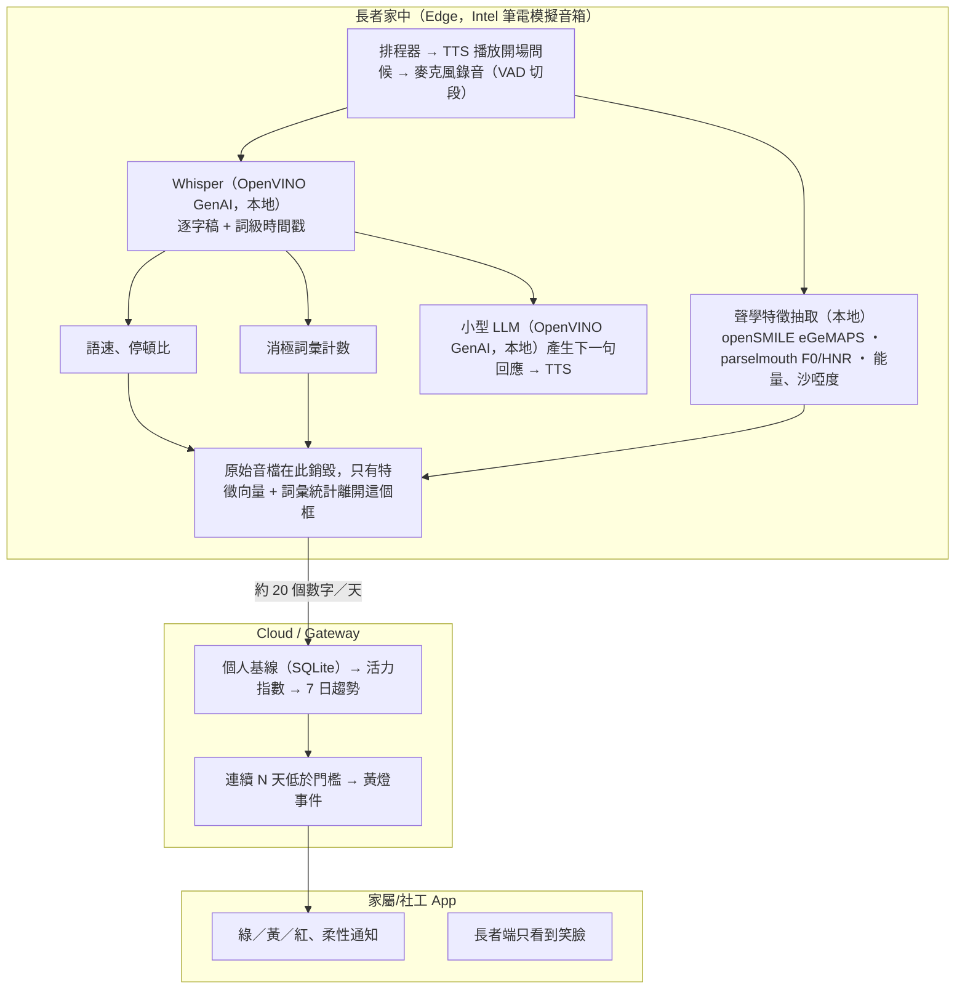

# PulseCare

從長者日常對話的**聲音**（不是內容）偵測活力狀態變化的隱私優先語音管線。

系統只問一句固定的開場問句，錄下回答，在本機抽取聲學特徵並與**長者自己過去 14 天的基線**比較，
換算成一個 0–100 的活力指數與燈號。原始錄音在特徵抽取完成後立即銷毀，離開這台機器的只有數值。

> 本系統計算的是「相對於個人基線的偏離程度」，**不是臨床診斷工具**，也不應被解讀為
> 憂鬱症篩檢結果。六項特徵目前為等權佔位權重，正式部署前需由合作心理師依臨床經驗校準。

## 核心設計原則

- **相對個人基線，不是跨人比較。** 指數 50 = 這位長者自己的常態，用 median/MAD 而非
  mean/std 建立基線，對感冒、訪客、電視聲等離群值穩健。
- **隱私優先，全程在本機推論。** 聲學特徵抽取、Whisper 轉錄、LLM 回應、TTS 合成都跑在本機
  （OpenVINO），不上雲；[analyze.py](recording_analysis/analyze.py) 與
  [live_session.py](live_conversation/live_session.py) 都在特徵抽取完成後立刻 `os.remove()`
  原始音檔。
- **語速從聲學算，不從逐字稿算。** 用 `loudnessPeaksPerSec` 當語速代理，語言無關（台語、國語、
  客語都能算），也不受 ASR 準確率影響。
- **用標準特徵集，不自創特徵。** 六項核心特徵取自 eGeMAPSv02，方便與既有文獻及合作心理師對照。

## 系統架構

> 下圖為概念示意圖，用來說明資料流向與隱私邊界，非最終系統實作規格。



## 快速開始

Python 3.11 或 3.12（3.13 部分套件輪子還不齊，別用）。

```bash
python3.12 -m venv .venv && source .venv/bin/activate
pip install -r requirements.txt
```

> **venv 的路徑不能包含非 ASCII 字元**（例如中文）。`opensmile` 底層用 `ctypes` 把安裝路徑
> 以純 ASCII 傳給 C library，venv 若建在類似 `D:\桌面\PulseCare\.venv` 這種路徑下，
> `opensmile.Smile(...)` 會直接丟 `UnicodeEncodeError`。專案程式碼本身放中文路徑沒關係，
> 但 **venv 要建在純 ASCII 路徑**（例如使用者家目錄下）。

Windows 上 `opensmile` 若安裝失敗，先裝 Visual C++ Build Tools。

Whisper（及 Phase 2 用到的 LLM／TTS）模型需另外用 `optimum-cli` 轉成 OpenVINO IR 才能跑，
完整步驟、模型選擇與已知陷阱見 **[`docs/plan.md`](docs/plan.md)**。

## 使用方式

只跑聲學特徵（不需模型）：

```bash
python recording_analysis/analyze.py sample.wav
```

加上本地 Whisper 轉錄：

```bash
python recording_analysis/analyze.py sample.wav --transcribe
```

比對個人基線，算出活力指數與燈號，並輸出家屬/社工 App 用的結構化報告：

```bash
python recording_analysis/seed_baseline.py --from-wav sample.wav --days 14 -o baseline.json
python recording_analysis/analyze.py sample.wav --baseline baseline.json --json out.json --elder-name 李奶奶
```

Phase 2：真的對著麥克風跑一輪「問候 → 回答 → 分析 → AI 回應」：

```bash
python live_conversation/live_session.py --baseline baseline.json --json app/live_example.json
```

逐步教學、六項特徵的意義、驗收標準與故障排除見 **[`docs/plan.md`](docs/plan.md)**。

## Demo 頁面

| 頁面 | 對象 | 說明 |
|---|---|---|
| [`app/clinician_demo.html`](app/clinician_demo.html) | 心理師/評審 | 按一次「Start Demo」自動播完整流程的單頁介面，讀取預先算好的音檔＋報告 |
| [`app/family_view.html`](app/family_view.html) | 家屬/社工 | 手機比例單頁：燈號卡片＋7 日趨勢圖＋柔性提示語 |

兩個頁面都不呼叫任何 Python，只讀取事先用 `analyze.py --json` 產生的靜態素材，需搭配
`python -m http.server` 以 `http://` 開啟（`file://` 會被同源政策擋掉）。完整拍攝腳本、
分鏡時間軸與旁白要點見 **[`docs/demo-steps.md`](docs/demo-steps.md)**。

## 專案結構

```
core/                聲學特徵、計分、轉錄——兩個 phase 共用的引擎
recording_analysis/  Phase 1 主 CLI：吃一支現成 wav 檔
live_conversation/   Phase 2：麥克風、VAD、本地 LLM、本地 TTS
app/                 家屬/社工與心理師示範用的靜態網頁
docs/                詳細步驟、拍攝腳本、TTS 可行性驗證記錄
```

| 檔案 | 用途 |
|---|---|
| `core/feature_keys.py` | 6 個核心特徵的鍵名（獨立成檔，讓 `scoring.py` 不用裝 librosa/opensmile 就能測試） |
| `core/features.py` | 聲學 + 詞彙特徵抽取 |
| `core/scoring.py` | 個人基線、活力指數、燈號、可解釋性、App 報告組裝 |
| `core/transcribe.py` | OpenVINO Whisper 本地轉錄 |
| `recording_analysis/analyze.py` | Phase 1 主 CLI |
| `recording_analysis/seed_baseline.py` | 產生合成基線（Demo 用），支援 `--trend flat/down/up` |
| `app/family_view.html` | 家屬/社工 App 畫面 |
| `app/clinician_demo.html` | 心理師/評審用自動播放示範頁 |
| `app/generate_examples.py` | 沒有真實錄音時，產生 App 畫面的示意資料 |
| `live_conversation/listen.py` | 麥克風錄音 + silero-vad 自動斷句 |
| `live_conversation/llm_reply.py` | 本地小型 LLM 生成回應（Qwen2.5 via OpenVINO GenAI） |
| `live_conversation/tts.py` | 本地文字轉語音（Qwen3-TTS via OpenVINO，設置見 `docs/tts-setup.md`） |
| `live_conversation/live_session.py` | Phase 2 主 CLI，真的對著麥克風跑一輪完整對話 |

`core/` 是兩個 phase 共用的引擎，`pytest.ini` 的 `pythonpath` 讓 `core`／`recording_analysis`／
`live_conversation` 三個資料夾互相看得到彼此，測試放在跟被測模組同一層資料夾。

## 測試

```bash
python -m pytest -q
```

## 文件索引

- [`docs/plan.md`](docs/plan.md) — 逐步環境建置、模型轉檔、六項特徵說明、驗收標準
- [`docs/demo-steps.md`](docs/demo-steps.md) — Demo 影片拍攝腳本、分鏡時間軸、旁白要點、故障排除
- [`docs/tts-setup.md`](docs/tts-setup.md) — Qwen3-TTS 可行性驗證與轉檔步驟
